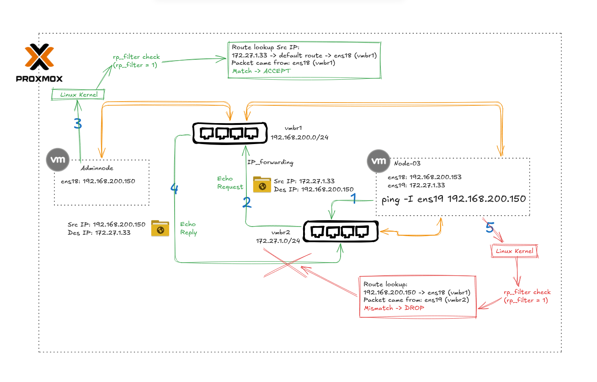

# Case Study: rp_filter Drop in Asymmetric Multi-NIC Routing

## Environment

| Node      | NICs                                                            |
|-----------|-----------------------------------------------------------------|
| Adminnode | `ens18` → `vmbr1` (`192.168.200.0/24`) only                    |
| Node-03   | `ens18` → `vmbr1` (`192.168.200.0/24`), `ens19` → `vmbr2` (`172.27.1.0/24`) |

Proxmox bridges: `vmbr1` and `vmbr2`, with **IP forwarding** enabled between them.

---

## What Happens

```bash
# Run on Node-03 — forces the packet to egress via ens19
ping -I ens19 192.168.200.150
```

| Step | Event | Result |
|------|-------|--------|
| 1 | Node-03 intentionally forces the Echo Request out via `ens19` (src: `172.27.1.33`) toward Adminnode (`192.168.200.150`) | → enters `vmbr2` |
| 2 | Proxmox IP forwarding routes the packet from `vmbr2` across to `vmbr1` | → reaches Adminnode |
| 3 | Adminnode `rp_filter` check: *"To reply to `172.27.1.33`, which interface would I use?"* → default route says `ens18` → matches ingress interface | ✅ **ACCEPT** |
| 4 | Adminnode sends Echo Reply, retracing the same path back through Proxmox | → arrives at Node-03 on `ens19` |
| 5 | Node-03 `rp_filter` check: *"Source IP is `192.168.200.150` — which interface would I normally use to reach it?"* → route table says `ens18` (same subnet) → but the packet came in on `ens19` | ❌ **DROP** |

**Outcome: `100% packet loss`** — the destination received the request and replied, but Node-03's own kernel discarded the reply before the ping process ever saw it.

---

## Root Cause

Node-03 has `ens18` on the same `192.168.200.0/24` subnet as Adminnode, so its routing table resolves `192.168.200.150` via `ens18` — the direct, shortest path. However, the Echo Reply arrived on `ens19`, creating an **asymmetric path**.

This asymmetry violates `rp_filter = 1` (Strict Mode): the kernel expects the ingress interface to match the interface it would use to reach the packet's source IP. When they don't match, the kernel suspects **IP spoofing or a routing anomaly** and silently drops the packet.

The misleading part: the network is actually working. Packets are delivered and Adminnode does reply — but Node-03 discards its own replies.

---

## Fix

```bash
# Relax rp_filter on ens19 to Loose Mode
sysctl -w net.ipv4.conf.ens19.rp_filter=2

# Persist across reboots
echo "net.ipv4.conf.ens19.rp_filter = 2" >> /etc/sysctl.d/99-rp-filter.conf
sysctl -p /etc/sysctl.d/99-rp-filter.conf
```

> `rp_filter = 2` (Loose Mode): only checks that a valid route exists for the source IP on *any* interface, not necessarily the one the packet arrived on. This accommodates asymmetric routing in multi-NIC environments.

---

## Diagram
