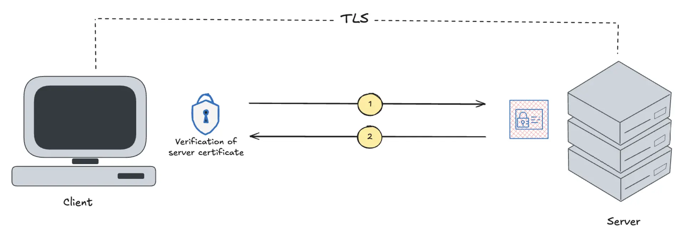
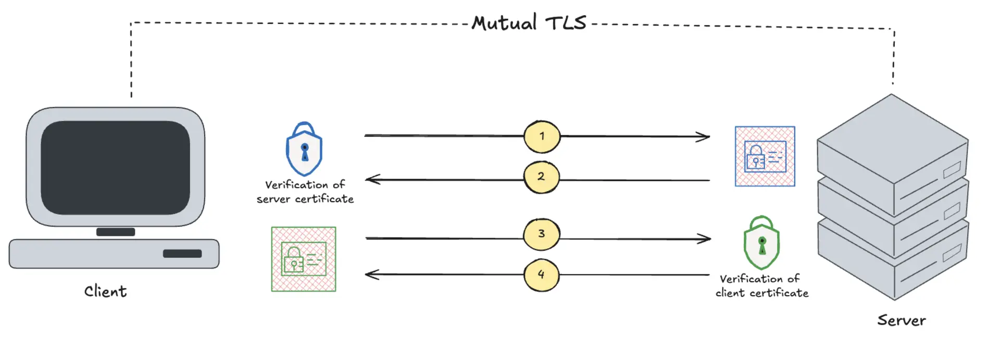
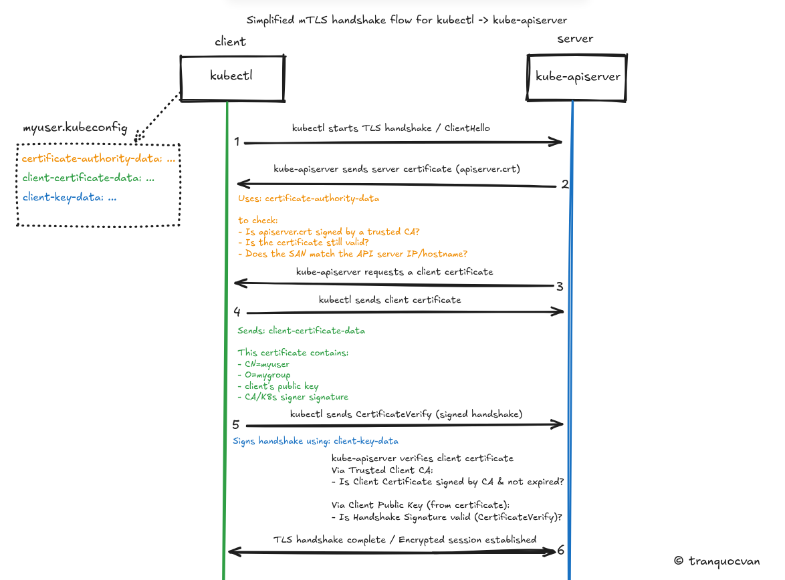

# Kubernetes Authentication via mTLS and kubeconfig

This document explains the certificate-based authentication model used by Kubernetes — from the underlying TLS/mTLS theory, through the X.509 and CSR standards, to a full walkthrough of provisioning a new user's access via the Kubernetes CSR API and RBAC.

## 1. Core Concepts

### 1.1 TLS — One-Way Authentication

When a browser connects to `vietcombank.com.vn`, how does it know the site is genuine and not a phishing clone? This is what the padlock icon represents: standard **TLS**, a *one-way* authentication scheme.

- The **client** (browser) inspects the **server's certificate** to verify the server's identity.
- The **server does not** verify the client's identity through a certificate. Instead, it relies on an application-level mechanism — typically a username/password login — to authenticate the user.


*Figure 1: In standard TLS, only the client verifies the server's certificate.*

### 1.2 mTLS — Mutual TLS Authentication

**mTLS** (**Mutual** TLS) extends this model so that authentication happens in both directions: the server verifies the client's certificate *and* the client verifies the server's certificate.

**In a Kubernetes context:**

- `kubectl` (the client) verifies the API server's certificate to make sure it is not sending commands to an impersonated or malicious endpoint.
- The API server (the server) in turn requires `kubectl` to present a valid client certificate (`.crt`) to prove the request genuinely comes from an authorized identity — e.g., `van.tran`.

No password prompt is involved at any point in this exchange.


*Figure 2: In mTLS, both client and server present and verify certificates.*

**mTLS and SSH Certificate Authority (SSH CA) share the same underlying security philosophy** — using certificates for bidirectional trust — but they target different actors:

| | SSH CA | mTLS |
|---|---|---|
| **Primary use case** | Human-to-machine | Machine-to-machine |
| **Typical actor** | An engineer logging into a Linux server | Microservices, pods, or `kubectl` talking to an API over HTTPS |
| **Interaction model** | Interactive, human-initiated session | Automated, high-throughput, no manual intervention |

**Applied to Kubernetes' `.kubeconfig` file**, two certificate components are central to the handshake:

- **`certificate-authority-data` (server side):** Used by the client to verify the identity of the Kubernetes API server — this is the standard TLS function of "verifying the server's identity to prevent impersonation."
- **`client-certificate-data` and `client-key-data` (client side):** These act as the user's "ID card." Every time a command such as `kubectl get pods` is issued, the client presents this certificate to the API server.

### 1.3 X.509 — The Certificate Standard

Kubernetes, like most web servers, uses digital certificates (`.crt` files) to prove identity. But if every organization invented its own certificate format, systems would be unable to interoperate. This is the problem **X.509** solves.

**X.509** is an international standard that defines the required structure of a digital certificate — analogous to a national ID card template that mandates "line 1 is the name, line 2 is the date of birth, the seal goes in the top-right corner."

A standard X.509 certificate file (e.g., `van.crt`) always contains three core pieces of information:

1. The subject's **public key**.
2. **Identity information** — Common Name (`CN=van.tran`), Organization (`O=cmc`), etc.
3. A **digital signature** from the issuing Certificate Authority (CA), along with a validity period.

### 1.4 CSR — Certificate Signing Request

Kubernetes (or any CA) does not simply hand out X.509 certificates on request — a user must first submit an **application**. That application is the **Certificate Signing Request (CSR)**.

A `.csr` file follows the **PKCS #10** standard.

**How a CSR is generated:**

1. Generate a **private key** locally, and keep it secret.
2. Mathematically derive a corresponding **public key** from it.
3. Package the public key together with the requester's identity (e.g., `van.tran`) into a `.csr` file. At this stage the CSR is like an application form with a photo attached — but not yet stamped/approved by any authority.
4. Submit the CSR to Kubernetes. Once approved, Kubernetes signs it (applies its cryptographic "seal") and returns a complete, valid **X.509** certificate.

## 2. Provisioning User Access on Kubernetes via RBAC

> Reference: [Kubernetes docs — Issue a Certificate for a Kubernetes API Client using a CertificateSigningRequest](https://kubernetes.io/docs/tasks/tls/certificate-issue-client-csr/)

### 2.1 Generate a Private Key and CSR

> Reference: [SSL.com — Comparing ECDSA vs RSA](https://www.ssl.com/article/comparing-ecdsa-vs-rsa-a-simple-guide/)

Generate an EC (Elliptic Curve) private key and the corresponding CSR:

```bash
openssl genpkey -algorithm EC -pkeyopt ec_paramgen_curve:prime256v1 -out <NAME>.key

openssl req -new -key <NAME>.key -out <NAME>.csr -subj "/CN=van.tran/O=cmc"
```

The two fields embedded in the CSR map directly to Kubernetes RBAC concepts:

- **`CN` (Common Name)** → corresponds to `kind: User` in RBAC.
- **`O` (Organization)** → corresponds to `kind: Group` in RBAC.

### 2.2 Submit the CSR to Kubernetes for Signing

Base64-encode the CSR file:

```bash
cat van.csr | base64 | tr -d "\n"
```

Create the corresponding `CertificateSigningRequest` manifest, `csr-request.yaml`:

```yaml
apiVersion: certificates.k8s.io/v1
kind: CertificateSigningRequest
metadata:
  name: van-tran-access
spec:
  request: <BASE64_ENCODED_CSR>
  signerName: kubernetes.io/kube-apiserver-client
  usages:
  - client auth
```

Apply the manifest:

```bash
kubectl apply -f csr-request.yaml
```

Check the CSR's status:

```bash
kubectl get csr
```

Approve the CSR — the actual certificate signing takes place as soon as it is approved:

```bash
kubectl certificate approve van-tran-access
```

### 2.3 Grant Permissions via RBAC (ClusterRole and RoleBinding)

Create the RBAC manifests that define what the new identity is permitted to do — a `ClusterRole` (or `Role`) describing the allowed verbs/resources, and a `RoleBinding` (or `ClusterRoleBinding`) that binds that role to the `User`/`Group` named in the CSR's `CN`/`O` fields.

Apply both resources:

```bash
kubectl --kubeconfig /home/van/K8s-Lab-DevOps/admin.conf apply -f van-role.yaml
kubectl --kubeconfig /home/van/K8s-Lab-DevOps/admin.conf apply -f van-rolebinding.yaml
```

### 2.4 Initialize the kubeconfig File

A `.kubeconfig` file bundles three Base64-encoded certificate artifacts, each playing a distinct role in the mTLS handshake:

| Field name | What it is | Role in mTLS |
| :--- | :--- | :--- |
| **`certificate-authority-data`** | The content of `ca.crt` — the K8s cluster's root certificate — Base64-encoded. | Lets your machine verify the API server is legitimate (you trust Kubernetes). |
| **`client-certificate-data`** | The content of `van.crt` — your personal "ID card" — Base64-encoded. | Proves to Kubernetes that the request comes from `van.tran` (Kubernetes trusts you). |
| **`client-key-data`** | The content of `van.key` — your private key — Base64-encoded. | Proves ownership: confirms you hold the private key matching the certificate above. |

#### Retrieve `ca.crt` (for `certificate-authority-data`)

```bash
scp root@<CONTROL_PLANE_IP>:/etc/kubernetes/pki/ca.crt .
```

#### Retrieve the user certificate (for `client-certificate-data`)

Extract the signed certificate directly from the approved CSR object:

```bash
kubectl --kubeconfig /home/van/K8s-Lab-DevOps/admin.conf get csr van-tran-access \
  -o jsonpath='{.status.certificate}' | base64 --decode > van.crt
```

#### `client-key-data`

This is simply the private key (`van.key`) generated in step 2.1 — no additional retrieval step is required.

#### Identify the API server endpoint

```bash
kubectl --kubeconfig /home/van/K8s-Lab-DevOps/admin.conf cluster-info
```

Example output:

```
Kubernetes control plane is running at https://192.168.100.211:6443
```

#### Build the kubeconfig file

**1. Register the cluster:**

```bash
kubectl config set-cluster kubernetes \
  --server=https://192.168.100.211:6443 \
  --certificate-authority=<PATH>/ca.crt \
  --embed-certs=true \
  --kubeconfig=<PATH>/van-tran.kubeconfig
```

**2. Register the user credentials:**

```bash
kubectl config set-credentials van.tran \
  --client-certificate=<PATH>/van.crt \
  --client-key=<PATH>/van.key \
  --embed-certs=true \
  --kubeconfig=<PATH>/van-tran.kubeconfig
```

**3. Define the context (binding cluster + user together):**

```bash
kubectl config set-context van-tran@kubernetes \
  --cluster=kubernetes \
  --user=van.tran \
  --kubeconfig=<PATH>/van-tran.kubeconfig
```

**4. Select the context for use:**

```bash
kubectl config --kubeconfig=van-tran.kubeconfig use-context van-tran@kubernetes
```

**5. Verify access:**

```bash
kubectl --kubeconfig=van-tran.kubeconfig get pods
```

If RBAC was configured correctly in step 2.3, the command should return results scoped to the permissions granted to `van.tran`, instead of a `Forbidden` error.

## 3. Visualizing the mTLS Handshake Flow

The sequence diagram below shows exactly how and when the three kubeconfig fields (`certificate-authority-data`, `client-certificate-data`, `client-key-data`) are used during a single `kubectl` command:


*Figure 3: Simplified mTLS handshake flow between kubectl and kube-apiserver (Designed by @tranquocvan).*

## References

- [Pinggy — TLS vs Mutual TLS](https://pinggy.io/blog/transport_layer_security_vs_mutual_transport_layer_security/)
- [Wikipedia — Mutual authentication](https://en.wikipedia.org/wiki/Mutual_authentication)
- [Kubernetes docs — Issue a Certificate for a Kubernetes API Client using a CertificateSigningRequest](https://kubernetes.io/docs/tasks/tls/certificate-issue-client-csr/)
- [Kubernetes docs — Using RBAC Authorization](https://kubernetes.io/docs/reference/access-authn-authz/rbac/)
- [Kubernetes docs — Organizing Cluster Access Using kubeconfig Files](https://kubernetes.io/docs/concepts/configuration/organize-cluster-access-kubeconfig/)
- [SSL.com — Comparing ECDSA vs RSA: A Simple Guide](https://www.ssl.com/article/comparing-ecdsa-vs-rsa-a-simple-guide/)
- [RFC 5280 — X.509 Public Key Infrastructure Certificate and CRL Profile](https://datatracker.ietf.org/doc/html/rfc5280)
- [RFC 2986 — PKCS #10: Certification Request Syntax Specification](https://datatracker.ietf.org/doc/html/rfc2986)