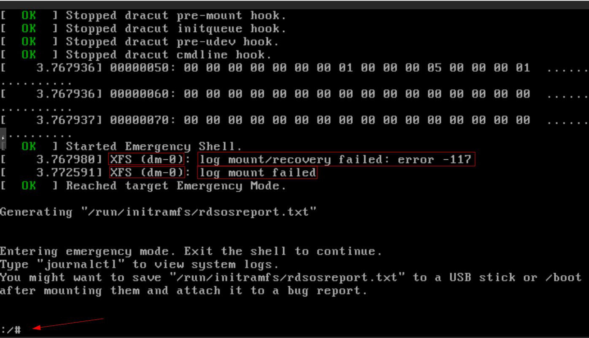
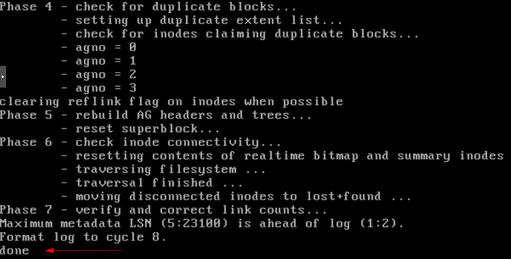
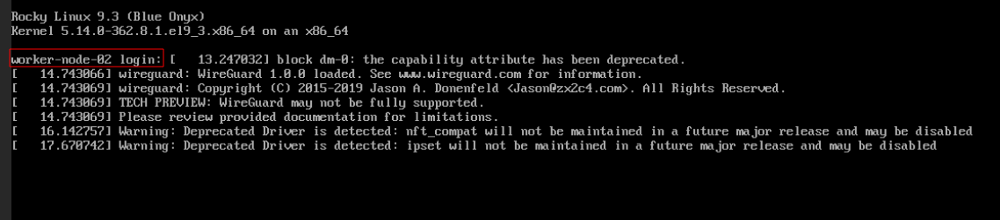

## Incident Report: XFS Log Recovery Failure (Proxmox VM)

### Context
- **Platform:** Proxmox VE
- **Guest OS:** Rocky Linux (XFS filesystem)
- **Storage:** LVM (`/dev/dm-0`)
- **Incident Type:** Filesystem Corruption / Boot Failure

---

### Problem Statement

The virtual machine failed to boot and entered **Emergency Mode** with the following error:

#### XFS (dm-0): log mount/recovery failed: error -117

- `XFS`: Filesystem in use
- `dm-0`: Logical Volume containing the root filesystem `/`
- `error -117`: XFS journal (log) replay failed during mount

As a result, the root filesystem could not be mounted, preventing the operating system from completing the boot process.

The root cause was identified as **XFS log corruption**, commonly triggered by:

- Hard stop / force power-off of the VM
- Using **Stop** instead of **Shutdown** in Proxmox
- Host crash or unexpected power loss

In this incident, the VM was terminated abruptly, causing XFS to leave its journal in an inconsistent state. During the next boot, XFS failed to replay the log and refused to mount the filesystem.

---

### 1️⃣ Initial Boot Failure (specifically on 2 vm)

The system dropped into **Emergency Mode** as the root filesystem could not be mounted.

---

### 2️⃣ Filesystem Check

The affected filesystem was identified on the LVM device `dm-0`, confirming the root partition was impacted.

--- 

### 3️⃣ Repair Execution

The `xfs_repair` utility was executed from Emergency Mode to attempt filesystem recovery.

--- 

### 4️⃣ Repair Output

The XFS log was cleared using the `-L` option, allowing the filesystem structure to be repaired.

---

### 5️⃣ Reboot Sequence

After completing the repair process, the VM was rebooted.

---

### 6️⃣ Successful Boot

The system booted successfully, and all services were restored to a healthy state.

